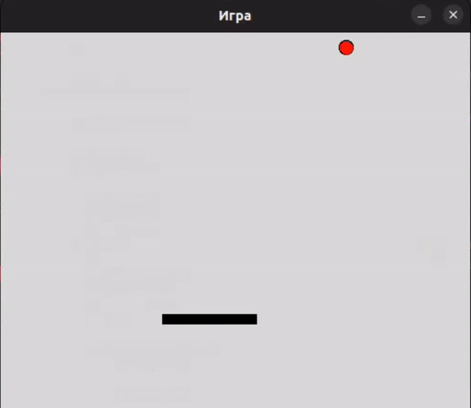
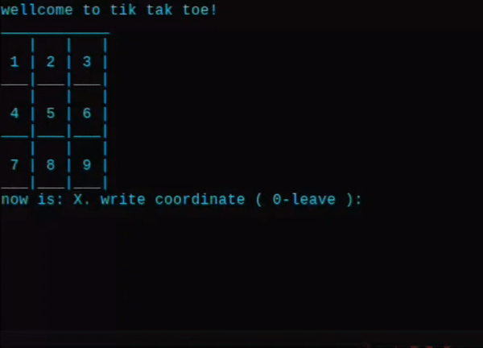

# Minigames

look here ! :)

### I decided to delete the previous repositories with minigames and add them all into 1. Later, maybe I will add more minigames and how to install them and play in general, these are simple projects to improve skillsS

## Navigation

### Python

[bouncing_ball](#minigame-1--bouncing-ball) \
[stickman_goes_to_exit](#minigame-2-stickman-go-to-the-exit) \
[TicTacToe_in_terminal](#minigame-3-tictactoe-in-terminal)

# Minigame 1 : Bouncing ball 

## Description:

For this game used this libraries : tkinter , random , time

gameplay very easy, you have ball that jumps every time when you hit that your paddle, in this game dont have mechanics that counts your score or mechanics that can restart game.

So you need to relaunch that game, for play if u loose, but you must clear your terminal for that

## How to play:

 i know, this looks strange for that game but just for info for all, movement just 3 buttons, to the left and right, use just normal arrows, like left and right, and we have 1 button from mouse or touchpad, for start game, just click 1 left button on mouse.

### Left arrow: turns to the left

### Right arrow: turns to the right

### Left mouse button: starting the game

## How to install:

if you use linux or MacOs install tkinter:

    sudo apt-get install python3-tk

other libraries has installed on base python,so that ok

### Game:

just install or copy code, here:

[Game-ball](bouncingball/code/poprigunchik.py) - here

# Minigame 2: Stickman-go-to-the-exit

This is a minigame that you can play 

### Gameplay

## Description:

This is just my little project where i used to train this libraries: tkinter, time, random, os

<b> In this minigame you must as a Stickman try to exit the level.

## How to play:

Movement is simple, just use a arrows on your keyboard</b>

### Jump : Arrow up 

### Run to left : Arrow left 

### Run to right : Arrow right

## How to install:

### just install 1 folder: 

[Folder](Stickman_go_to_exit/assets%20and%20code/)

#### 1: code of game

#### 2: assets for game

### that will be in one folder 

## Finish gameplay

# Minigame 3: TicTacToe in terminal

Here is my minigame that i make without any libraries

<b>just a normal Tic Tac Toe on Python</b>

## Gameplay:

### Description
X and O here one by one playing, You can play with your friends like someone chose a coordinates and write a number of that and there will write X or O 

So for play just write a number 1 - 9

## How to install: 

just install code from here :

[Code](TicTacToe_in_terminal/code/krestiki_noliki.py)

